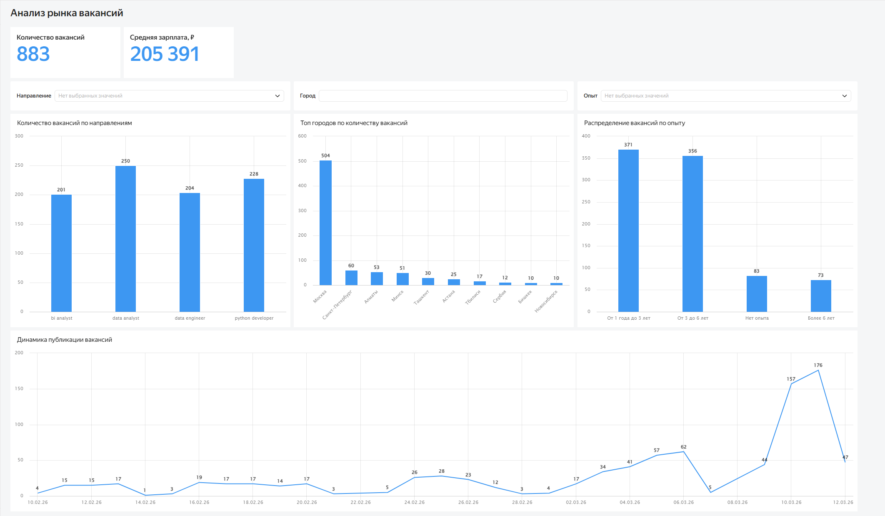
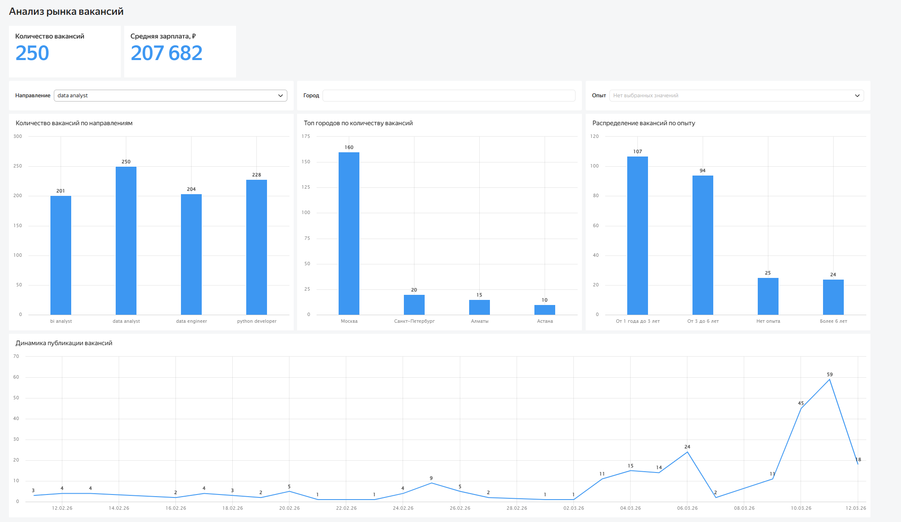
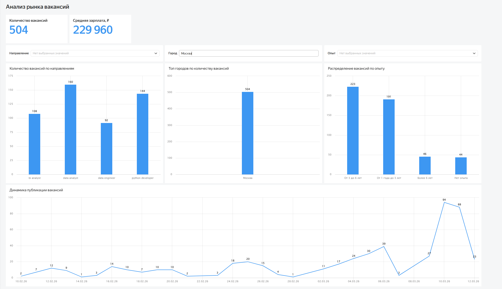
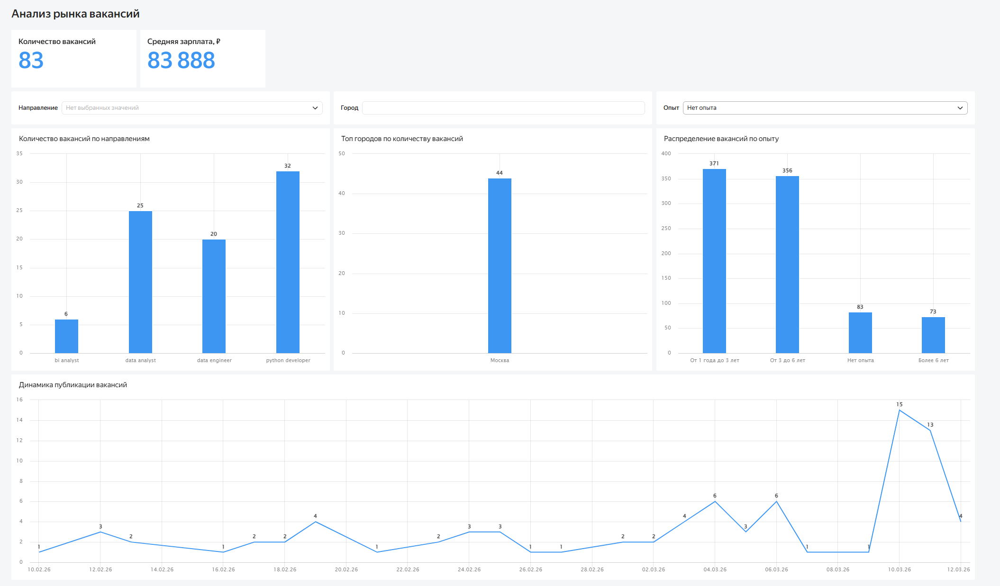

# HH Vacancy Analytics

Проект собирает данные о вакансиях через API hh.ru, сохраняет их в PostgreSQL и подготавливает данные для аналитики и визуализации в Yandex DataLens.

## Стек
- Python
- PostgreSQL
- Yandex DataLens

## Пайплайн данных
HH API → Python → PostgreSQL → SQL витрина → DataLens Dashboard

## Что делает проект
- собирает вакансии через API hh.ru
- сохраняет данные в PostgreSQL
- подготавливает витрину данных для аналитики
- строит интерактивный BI-дашборд в Yandex DataLens

## Метрики
- количество вакансий
- средняя зарплата
- распределение по направлениям
- распределение по городам
- распределение по уровню опыта
- динамика публикаций

## Дашборд

## Дашборд с фильтрами

## Основные выводы

- Наибольшее количество вакансий - Data Analyst и Python Developer
- Основная концентрация вакансий - Москва и Санкт-Петербург
- Наиболее востребованный опыт - 1–3 года и 3–6 лет